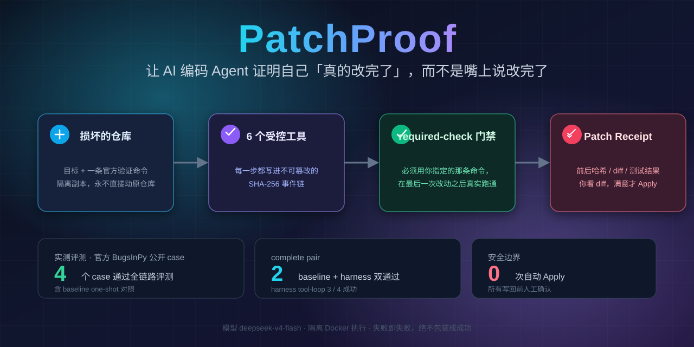
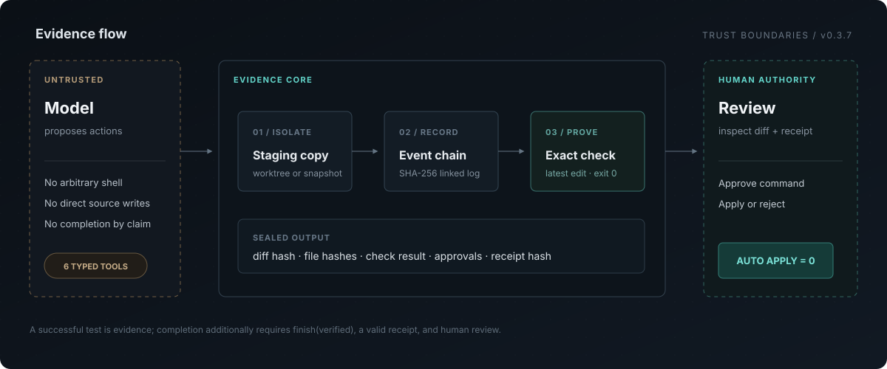

<p align="center">
  
</p>

<div align="center">

# PatchProof

**让 AI 编码 Agent 证明它真的改完了。** 不是再相信一次模型自述，而是审阅一条可复核的完成证据链。

[](pyproject.toml)
[](pyproject.toml)
[](docker/evaluator/Dockerfile)

[项目说明](#第一章) · [Windows 双击演示](#windows-本地一键演示) · [Linux 自托管](#linux-一键自托管) · [实测证据](#实测证据) · [架构与安全](#架构与安全) · [完整文档](#文档导航)

</div>

PatchProof 把 Agent 放进隔离工作区，只开放 6 个类型化工具；每次动作、观察与审批都进入 SHA-256 事件链。只有在最后一次编辑之后，**逐 argv 匹配并跑通任务指定的验证命令**，它才能生成 Patch Receipt。最终 diff 始终由人审阅，**永不自动 Apply**。

| 已验证的公开样本 | 完整证据对 | 自动 Apply | 证据出口 |
|---:|---:|---:|---|
| 3 个 BugsInPy case | 3 / 3 | **0 次** | diff + required-check + receipt + event chain |

> 这些数字描述的是当前仓库内可追溯的评测结果，不是通用模型能力声明。一个更复杂的公开样本 `pysnooper-2` 在预算内未完成修复。

## 第一章

### PatchProof 是做什么的

PatchProof 是一个给 AI 编码 Agent 加上“验收层”的工程工具。它不负责训练模型，也不是另一个代码补全 IDE；它负责把模型提出的修改，变成一份**可以复核、可以追踪、可以由人决定是否写回**的工程结果。

普通 AI 编码工具通常把“模型说已经修好了”当作任务终点。PatchProof 把终点拆成四个可检查的问题：

1. **它改的是不是一个隔离副本？** 模型不能直接碰你的源仓库。
2. **它到底做了什么？** 搜索、读取、编辑、检查和审批都进入事件链。
3. **它真的修好了吗？** 必须在最近一次编辑之后，按任务指定的原始命令完成验证。
4. **你是否同意写回？** 系统生成 diff 和 Patch Receipt，只有人工 review 后才允许 Apply。

输入是一份目标仓库、一个要解决的问题和一条验收命令；输出不是一段模型解释，而是一组可以继续审阅的工程证据：

| 输入 | PatchProof 处理 | 输出 |
|---|---|---|
| 损坏的仓库 / 任务目标 | 建立 detached worktree 或 snapshot | 隔离副本中的修改 |
| `check_command` | 在最近一次编辑后按原 argv 执行 | required-check 结果与退出码 |
| 模型动作与审批 | 写入 SHA-256 链式事件记录 | 可追踪的过程日志 |
| 文件 diff 与哈希 | 生成并校验 Patch Receipt | 人工 review 后 Apply 或 Reject |

它适合三类场景：个人开发者想让 Agent 改代码但不想交出源仓库控制权；团队需要在合并前审查 Agent 的修改证据；研究者需要用一致的门禁、预算和隔离环境比较 Agent 的修复能力。模型可以失败、超时或无法运行，但系统不会把“没有完成”伪装成“完成”。

一句话概括：**PatchProof 不是让 AI 更会写代码，而是让 AI 写完代码之后，结果有凭有据。**

## Windows 本地一键演示

已安装 [uv](https://docs.astral.sh/uv/)、Node.js 和 pnpm 的 Windows 10/11 用户，可直接双击根目录的 **`demo.cmd`**。首次运行会安全询问模型端点和 API key、同步锁定依赖、启动前后端，健康检查通过后打开 `http://localhost:5175`。

```powershell
.\demo.cmd
```

API key 使用当前 Windows 用户的 DPAPI 加密保存在 Git 忽略的本地配置中，不进入命令行、日志或前端 `localStorage`。常用命令为 `.\demo.cmd status`、`logs`、`stop` 与 `configure`；安全设计和故障排查见 [Windows 本地演示指南](docs/LOCAL_DEMO.md)。

## 工作流

<p align="center">
  
</p>

1. **隔离** — 在 detached worktree 或 snapshot 中工作，不直接改源仓库。
2. **受控行动** — 模型只能搜索、读取、编辑、查看 diff、运行检查、声明完成；编辑必须带精确旧片段或文件哈希。
3. **强制验收** — 只有任务创建时指定的那条命令，在最近一次编辑后真实成功，才取得完成资格。
4. **密封证据** — 计划、工具记录、文件前后哈希、diff 哈希、测试退出码与审批轨迹写入 Patch Receipt，并与事件链相互校验。
5. **人工裁决** — 进入 `awaiting_apply` 后暂停；你审 diff、看证据，再决定是否写回。

请求数、token 与费用在每次模型调用前按最坏情况预留，并受共享硬预算约束。预算耗尽、环境不可复现、输出截断、编辑前置条件失败都会得到明确分类，不会伪装成成功。

## 实测证据

### BugsInPy 公开案例

3 个案例通过了 baseline one-shot 与 harness tool-loop 的成对评测；公开/真实评测运行在固定 digest 的 Docker 镜像中，禁用网络、使用只读 rootfs，且不挂载 Docker socket。

| case | 缺陷 | baseline | harness | tool-loop 步数 |
|---|---|---:|---:|---:|
| `pysnooper-1` | 中文源码被 `ascii` 解码 | 通过 | 通过，`awaiting_apply` | 7 |
| `pysnooper-3` | 文件输出引用未定义的 `output_path` | 通过 | 通过，`awaiting_apply` | 3 |
| `fastapi-1` | `jsonable_encoder` 缺少 `exclude_defaults` | 通过 | 通过，`awaiting_apply` | 7 |

两份隔离副本在模型构建前都必须产生一致的非零失败；通过、不可运行、环境不兼容或失败不一致的样本不会进入评分。`pysnooper-2` 涉及 `custom_repr` 跨 3 处接线，模型在共享预算内未完成，按 `llm_budget_exhausted` 如实记录且不计入 3 / 3。

**Provenance。** BugsInPy 上游 PySnooper / FastAPI 测试依赖评测镜像未安装的库，本仓库因此保存自包含的重建测试契约，逐断言验证 buggy 版本失败、官方修复后通过。测试契约可见于 [`benchmarks/public/`](benchmarks/public/)；库代码修复仍全部由模型完成。第三方源码快照不下沉仓库，公开案例的解析、镜像构建与复现步骤见 [评测指南](docs/EVALUATION.md)。

**运行时边界。** PatchProof 项目本身要求 **Python ≥3.12**；BugsInPy evaluator 为兼容被测项目固定在 **Python 3.8.20**。这是两个不同运行环境，不代表主项目支持 Python 3.8。

### 自持 smoke 语料

5 个 mini fixture 用于验证管道，而非衡量真实修复难度。它们全部达到 `awaiting_apply`，且 `required_check_verified`、receipt 文件与事件链校验均通过，`precondition_failures == 0`。

`validation` · `config-precedence` · `pagination` · `idempotency` · `serialization`

## 手动开发启动

需要 Python 3.12+、[uv](https://docs.astral.sh/uv/)、Node.js 与 pnpm。后端：

```powershell
uv sync
uv run uvicorn patchproof.api:app --app-dir src --port 8010
```

另开终端启动前端：

```powershell
cd frontend
pnpm install
pnpm run dev
```

打开 `http://localhost:5175`；默认目标是仓库内安全 fixture `benchmarks/fixtures/validation`。

> Windows 下不要添加 `uvicorn --reload`。reload worker 可能使用 `SelectorEventLoop`，使 `asyncio.create_subprocess_exec` 抛出 `NotImplementedError`；后端已在非 reload 模式显式设置 Proactor 策略。

### 验证管道

不调用模型的确定性 smoke suite：

```powershell
uv run python -m patchproof.benchmark smoke `
  --manifest benchmarks/manifest.v2.json --project-root . `
  --output data/benchmark-smoke.json
```

安全钩子故障注入：

```powershell
uv run python -m patchproof.faults run --output data/fault-report.json
```

公开模型评测需要显式确认、固定镜像与预算上限；完整准备和复现命令见 [docs/EVALUATION.md](docs/EVALUATION.md)。Web 任务可由浏览器按任务提供 provider，API key 只在运行期内存中短驻且不会落库或进入日志；CLI 评测也支持显式环境配置。

## Linux 一键自托管

Linux 服务器已安装 Docker Engine + Compose v2，且域名已解析到服务器时，在仓库根目录运行：

```bash
bash deploy/deploy.sh patchproof.example.com
```

Caddy 自动配置 HTTPS，域名同时驱动后端 CORS。没有域名时可用 `bash deploy/deploy.sh --localhost` 启动仅监听本机的 HTTP 冒烟环境。脚本还提供 `status`、`upgrade`、`logs` 与 `uninstall`；持久数据保存在 `deploy/data/`，任务仓库放在 `deploy/repositories/<name>`。

部署脚本不读取或写入 LLM key，用户在浏览器中自带 key。默认 Compose 也不挂载宿主机 Docker socket，因此 Web 部署本身不获得公开评测所需的 Docker 隔离能力；相关任务会保持 blocked，不会降级成本地执行器冒充隔离。详见 [部署文档](docs/DEPLOYMENT.md)。

## 架构与安全

```text
Vue Evidence Console ── FastAPI / SSE ── TaskManager ── durable state machine
                                              │
                    ┌─────────────────────────┼──────────────────────┐
                    ▼                         ▼                      ▼
             typed agent loop          SQLite event chain     Patch Receipt
                    │
          policy gate + workspace strategy
                    │
            Docker evaluator / explicit local_smoke_only
```

核心不变量：

- **模型不受信任**：输出先通过严格 schema，只能调用有限工具；执行使用 argv 与 `shell=False`。
- **工作区有边界**：路径必须落在 staging root，敏感/隐藏文件默认禁止编辑，删除不会静默写回。
- **检查不可替换**：任意“看起来成功”的命令不能替代原始 `check_command`，后续编辑会让旧验证失效。
- **证据可检验而非不可破坏**：SQLite 不是 write-once ledger；SHA-256 链和 receipt 文件哈希负责暴露篡改，不能阻止特权用户改库。
- **Apply 属于人**：风险命令需要审批，写回前还会复核原 HEAD、工作树与 manifest。
- **本地执行器不是沙箱**：`local_smoke_only` 仍继承操作系统用户权限；公开/真实评测缺少 Docker 前置条件时必须阻断。

模块职责、状态转换与 threat model 分别见 [架构文档](docs/ARCHITECTURE.md) 和 [威胁模型](docs/THREAT_MODEL.md)。

## 文档导航

| 文档 | 内容 |
|---|---|
| [Architecture](docs/ARCHITECTURE.md) | 状态机、模块边界、receipt 与事件链 |
| [Threat Model](docs/THREAT_MODEL.md) | 信任边界、安全不变量、明确限制 |
| [Evaluation](docs/EVALUATION.md) | 公开案例准备、运行与复现 |
| [Benchmark](docs/BENCHMARK.md) | smoke / real 模式与报告结构 |
| [Dataset](docs/DATASET.md) | 语料 provenance 与解析策略 |
| [Docker](docs/DOCKER.md) | evaluator 镜像与隔离要求 |
| [Windows local demo](docs/LOCAL_DEMO.md) | DPAPI 配置、本地启动、日志与停止 |
| [Deployment](docs/DEPLOYMENT.md) | 自托管、运维和部署边界 |
