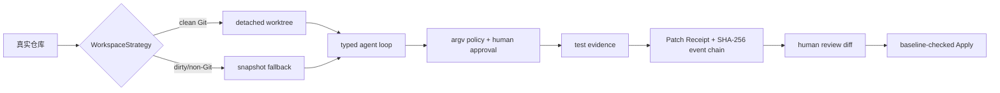

# PatchProof

> Evidence-first Coding Agent Harness —— 让一个 Agent 有资格声称"我完成了"。

PatchProof 不是又一个 Claude Code / OpenHands / Aider 的克隆，它专门回答一个问题：

> **Agent 凭什么有资格声称"完成了"？**

它的答案是一条可验证的证据链：**Inspect → Plan → Typed Tool Loop → Test/Repair → Patch Receipt → Human Apply**。没有证据，模型说"完成"不算数；证据被篡改，链头立刻暴露；编辑没有前置校验，拒绝盲写。



---

## 实测评测结果（真实模型）

### 配置

| 项 | 值 |
|---|---|
| 模型 | `deepseek-v4-flash`（OpenCode `go` 网关，OpenAI-compatible transport） |
| 推理 | 关闭（`PATCHPROOF_LLM_REASONING=off`，避免输出预算被 reasoning 吃掉） |
| 隔离 | Docker 钉死 digest，`--network none`，只读 rootfs，无 docker socket |
| 失败门禁 | 两个隔离副本必须产生**一致的非零失败**，环境不可复现/超时/不一致不参与评分 |
| 预算 | 共享 requests/tokens/cost 账本，硬上限，超出即停 |
| Apply | 永不自动 Apply；所有写回前人工确认 |

### 结果

#### PatchProof 自持 mini 语料 —— 5 / 5 通过

| case | baseline one-shot | harness tool-loop |
|---|---|---|
| mini-validation | ✅ | ✅ |
| mini-config-precedence | ✅ | ✅ |
| mini-pagination | ✅ | ✅ |
| mini-idempotency | ✅ | ✅ |
| mini-serialization | ✅ | ✅ |

harness 侧全部 `awaiting_apply`，`required_check_verified` / `receipt_verified` / `receipt_file_verified` / `event_chain_verified` 全为真，`precondition_failures == 0`。总成本约 **$0.14**。

#### BugsInPy 官方公开 case —— 1 / 1 通过，complete pair

`bugsinpy-pysnooper-1`（PySnooper issue #124，官方修复 commit `56f22f8`）：

| 指标 | baseline one-shot | harness tool-loop |
|---|---|---|
| 结果 | ✅ success | ✅ success（`awaiting_apply`） |
| steps / tool calls | 1 / 0 | 8 / 8 |
| 修改文件 | `pysnooper/tracer.py` | `pysnooper/tracer.py` |
| patch 大小 | 443 B | 443 B |
| 失败分类 | — | —（0 前置失败） |
| required-check / receipt / 事件链 | n/a（one-shot） | ✅ / ✅ / ✅ |

- `complete_pairs: 1, partial_runs: 0` —— baseline 与 harness 的完整对照成立
- 门禁初始证据：`pytest -q -s tests/test_chinese.py::test_chinese` returncode 1（真实断言失败：中文源码行被 `ascii` 解码乱码）
- 修复内容：`get_source_from_frame` 无 PEP-263 声明时默认 `ascii` 解码 → 改为 Python 3 默认的 `utf-8`
- 总成本约 **$0.10**（10 次请求）

> **诚实声明（provenance）**：PySnooper 官方 `tests/test_chinese.py` 依赖 `python_toolbox`，评测镜像（Python 3.8）未安装；本仓库使用**自包含的重建版本**（按官方测试断言逐字节验证过：buggy 失败 / 一行修复后通过），与官方测试同语义，MIT 许可，随仓库维护在 [`benchmarks/public/pysnooper-1/test_chinese.py`](benchmarks/public/pysnooper-1/test_chinese.py)。评测语义 = 官方测试作为契约提供给模型（SWE-bench 范式），**库代码的修复由模型完成**。

> **复现公开 case**：`data/eval-cache/` 已被 `.gitignore` 忽略（第三方源码不下沉仓库）。clone 后需先 `resolve-public` 拉取 PySnooper buggy snapshot，再把上面的测试契约复制进该 snapshot 的 `tests/test_chinese.py`，然后跑 `real` 评测。具体命令见 [docs/EVALUATION.md](docs/EVALUATION.md)。

### 对结果的诚实边界

- mini 语料是 PatchProof 自持、单文件、带意图说明的 fixture，作用是**验证管道**，不证明模型修真实 bug 的能力。
- BugsInPy 5 个公开 case 中仅 pysnooper 可运行；其余 4 个（youtube-dl / black / cookiecutter / httpie）因 Python 3.6/3.7 环境与评测镜像不兼容被诚实标记 `environment_unreproducible`，**不参与评分**。
- 模型质量结论仅覆盖"小型、单文件、有测试契约"的任务；更大规模的真实修复能力需要更大语料才能下结论。

---

## 为什么证据可信

- **required-check 资格门禁**（`runner.py`）：只有与任务 `check_command` **完全一致**的规范化 argv，在**最近一次编辑之后**成功执行，`finish(verified)` 才被接受。`python --version` 之类的任意成功命令不能声称完成。
- **不可篡改事件链**（`storage.py`）：每个计划、tool action、observation、审批、结果都串成 SHA-256 哈希链，篡改即暴露链头不一致。
- **Patch Receipt**（`receipt.py`）：目标、基线、模型、计划、工具统计、文件前后 hash、diff hash、命令退出码、审批轨迹、测试结果、verdict 统一为可验证 JSON，原子写入 `data/runs/<id>/receipt.json`。
- **编辑前置校验**：`apply_edit` 必须提供精确唯一 `old_text` 或匹配的 `expected_sha256`，禁止盲写；行尾无关匹配（CRLF/LF 兼容）。
- **诚实失败分类**：`baseline_precondition_failed` / `llm_budget_exhausted` / `provider_output_truncated` / `environment_unreproducible`…失败就是失败，绝不把部分结果包装成成功。
- **永不自动 Apply**：receipt 生成后必须人工 review diff 再 Apply；Apply 前校验 HEAD、工作树与源文件 manifest。

---

## 真实系统中暴露并修复的基建 bug

在真实评测跑通过程中，暴露了 5 个单测覆盖不到的基础设施问题（每个都可审计、可回滚）：

| # | Bug | 影响 | 修复 |
|---|---|---|---|
| 1 | Docker `--mount ...,rw` 裸布尔字段被 29.6.2 拒绝 | 容器无法启动，所有 Docker 评测/探针全挂 | `docker_executor.py` |
| 2 | 默认开启推理吃掉全部输出预算 | 任何请求 `provider_output_truncated` | `config.py` + `llm.py` 加 `PATCHPROOF_LLM_REASONING` |
| 3 | `_iter_files` 用绝对路径 parts 排除目录 | 位于 `data/` 下的仓库索引为空 | `repo_index.py` |
| 4 | **CRLF/LF 不匹配**：Windows 上 git `core.autocrlf=true` 检出，模型发出的 `old_text`（`\n`）匹配不到 `\r\n` 文件 | 所有 `apply_edit` 前置失败（"前置文本不存在"） | `workspace.py` 行尾无关匹配 |
| 5 | **时间戳不定性**：测试输出带 `HH:MM:SS`，两次门禁运行不一致 | `initial_check_nondeterministic` 拦死真实评测 | `artifact_policy.py` 归一化 ISO 时间戳 |

---

## 快速开始

后端：

```powershell
.venv\Scripts\python.exe -m uvicorn patchproof.api:app --app-dir src --reload --port 8010
```

前端：

```powershell
cd frontend
pnpm install
pnpm run dev
```

打开 `http://localhost:5175`。默认目标仓库为 PatchProof 自带的 `benchmarks/fixtures/validation` 安全 fixture。

## Benchmark 用法

确定性 smoke suite（不调用模型，验证管道）：

```powershell
.venv\Scripts\python.exe -m patchproof.benchmark smoke `
  --manifest benchmarks/manifest.v2.json --project-root . --output data/benchmark-smoke.json
```

安全钩子故障注入：

```powershell
.venv\Scripts\python.exe -m patchproof.faults run --output data/fault-report.json
```

真实模型评测（显式确认 + 预算上限，永不自动 Apply）：

```powershell
.venv\Scripts\python.exe -m patchproof.benchmark real `
  --manifest benchmarks/manifest.v2.json `
  --project-root . --output data/benchmark-real.json `
  --confirm-real --confirm-public-code-egress `
  --max-cases 5 --repeats 1 --max-requests 60 --max-tokens 400000 --max-cost-usd 2
```

Provider 配置只读自 `archive/researchflow/.env`（DEEPSEEK_* / ANTHROPIC_*），密钥不复制、不落盘、不进日志。

## 架构

| 模块 | 职责 |
|---|---|
| `runner.py` | typed tool loop、required-check 资格门禁、receipt 生成 |
| `workspace.py` | detached worktree / snapshot fallback、编辑前置校验、写回校验 |
| `storage.py` | SQLite 可恢复状态机、SHA-256 事件链 |
| `llm.py` | Anthropic / OpenAI-compatible 双 transport、预算账本 |
| `policy.py` | argv + `shell=False` 策略，风险命令人工审批 |
| `benchmark.py` / `evaluation.py` | smoke / resolve-public / real 评测，诚实失败分类 |
| `docker_executor.py` | 钉死 digest 的隔离执行器 |
| `public_resolver.py` | BugsInPy 解析、HEAD/镜像校验、可执行状态标记 |
| `receipt.py` / `artifact_policy.py` | receipt 密封与篡改检测、deny 策略 |
| `frontend/` | 轻量 UI（任务、事件链、receipt、diff review） |

## 安全模型

- 执行器 `argv + shell=False`；组合命令、联网、安装、删除、Git 写操作需人工审批。
- 本地 process executor 明确标记 `local_smoke_only`，绝不冒充容器隔离。
- `apply_edit` 需要 `expected_sha256` 或精确 `old_text` 前置条件；删除不静默写回；敏感/隐藏文件默认禁编辑。
- `bug_patch.txt` 等已知答案 artifact 永不索引、不进入工作区、不暴露给 prompt/报告。

## 已知局限

- 公开语料仅 1 个 case 可运行（其余环境不兼容），模型能力结论样本小。
- mini fixture 含意图注释，适合冒烟不适合当难度基准。
- 尚未与 OpenHands / Aider / SWE-agent 做同 case 对照实验。
- 无 LSP/语义导航，代码上下文为确定性静态索引。

## 文档

- [docs/ARCHITECTURE.md](docs/ARCHITECTURE.md)
- [docs/THREAT_MODEL.md](docs/THREAT_MODEL.md)
- [docs/BENCHMARK.md](docs/BENCHMARK.md)
- [docs/DATASET.md](docs/DATASET.md)
- [docs/DOCKER.md](docs/DOCKER.md)
- [docs/EVALUATION.md](docs/EVALUATION.md)
