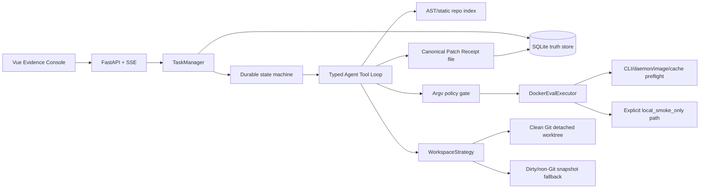

# PatchProof v0.3.7 Architecture

PatchProof is an Evidence-first Coding Agent Harness. Its product boundary is
not “how many tools can an agent call”; it is whether a completion claim can be
replayed and challenged.

## State machine

`queued → inspecting → planning → editing/testing/repairing → awaiting_apply → completed`

The loop has two explicit pause points: an untrusted command enters
`awaiting_command_approval`, and a verified patch enters `awaiting_apply`.
Process restarts convert running states to `interrupted`; they never silently
become `completed`.

Every state transition, plan, typed action, observation, model usage record,
approval and receipt marker is an event. Events are ordered per task and chained
with SHA-256 over canonical JSON plus the previous event hash.

`check_command` is parsed once when a task is created. A `finish(verified)` is
entitled only when a successful `run_check` has exactly the same normalized argv
and its evidence generation equals the latest edit generation. An arbitrary
successful command is recorded but cannot satisfy this invariant. The sealed
receipt is atomically written to `data/runs/<task>/receipt.json`; SQLite stores
the real file-byte hash so the API can distinguish a valid receipt from a
missing or tampered artifact. Apply reseals the receipt after the completed
event and rewrites the artifact.

## Layer boundaries

- `storage.py`: only durable SQLite state and event/approval/receipt persistence.
- `manager.py`: lifecycle, recovery, approval waiters and API-facing snapshots.
- `workspace.py`: replaceable isolation/write-back strategies and preconditions.
- `agent_tools.py`: strict Pydantic action schemas and the finite tool catalog.
- `runner.py`: bounded model → action → observation loop; no arbitrary shell or
  Python tool dispatch.
- `policy.py`: argv classification and local-smoke process execution with
  timeout and output limits.
- `models.py`: strict versioned `BenchmarkCase` v2, resource and fault contracts.
- `corpus.py`: canonical case keys, fetch plans, immutable checkout verification;
  no download without confirmation.
- `docker_executor.py`: injectable Docker argv, preflight, setup/execution
  network separation and hard isolation flags.
- `evaluator_image.py`: confirmed Docker build argv, inspected immutable image
  identity and checksummed evaluator-image lock.
- `public_resolver.py`: official BugsInPy metadata/source verification,
  strict single-command task semantics, pinned-runtime failing-check probes,
  content-addressed caches and separate resolved public lock manifests.
- `budget.py` / `evaluation.py`: shared worst-case request ledger, fair repeats,
  append-only JSONL and partial-pair-aware aggregate reports.
- `config.py` / `llm.py`: explicit Anthropic-compatible and OpenAI-compatible
  transports. DeepSeek/OpenCode uses chat completions while preserving the
  same reserve-before-call budget boundary and explicitly classifying
  provider token-limit truncation after observed usage is committed.
- `faults.py`: executable offline hooks for all twelve deterministic safety
  scenarios.
- `receipt.py`: canonical completion evidence, atomic artifact writing and hash verification.
- `benchmark.py`: five-mini-repo fail-before/one-edit/pass-after smoke plus a
  bounded, one-request real baseline using strict compact exact replacements,
  compared with the harness on oracle-stripped case views.
- `artifact_policy.py`: central answer/oracle denial, sanitized source copying,
  deterministic snapshot identity and bounded initial-check output redaction.
- `evaluation.py`: two-copy initial-failure gate and byte-identical focused
  evidence/context before either model is constructed.

The repository index is static and line-addressable. RAG is intentionally not a
requirement for code navigation: deterministic AST/search context is easier to
audit and reproduce than opaque retrieval for this product.
