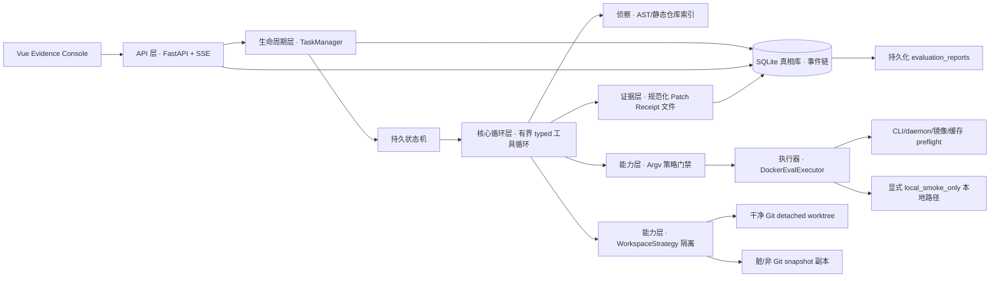

# PatchProof v0.3.7 架构文档

PatchProof 是一个 **Evidence-first（证据优先）的 AI 编码 Agent 编排框架**。它的产品边界
不是"Agent 能调用多少工具"，而是：**"完成"这个声明能不能被重放、被质疑、被验证。**

一句话概括：**PatchProof 不是让 AI 更会写代码，而是让 AI 写完代码之后，结果有凭有据。**

它把模型放进隔离工作区，只开放 6 个类型化工具；模型的每次动作、观察与审批都进入
SHA-256 事件链；只有在最后一次编辑之后，**逐 argv 匹配并真实跑通任务指定的验证命令**，
它才能生成 Patch Receipt。最终 diff 永远由人审阅，**系统永不自动 Apply**。

本文档覆盖：分层总览 → 目录与模块职责 → 任务状态机 → 核心工具循环 → 完成资格模型 →
证据系统 → 工作区与命令安全 → 评测子系统 → 配置系统 → 数据流 → 信任边界 → 设计决策 →
部署形态。想跟着调试器看运行时的行为，配合 [DEBUG_GUIDE.md](DEBUG_GUIDE.md)；想查每个
函数的调用关系，配合 [CALL_MAP.md](CALL_MAP.md)；想按流程逐模块精读代码，配合
[CODE_GUIDE.md](CODE_GUIDE.md)。

---

## 1. 总体架构：五层同心圆

程序从外到里分 5 层，请求从外往里走，证据从里往外写：



| 层 | 目录 | 职责 |
|---|---|---|
| **HTTP 层** | `api/` | 把内部能力暴露成 REST / SSE，薄适配器 |
| **生命周期层** | `task/service.py` | 任务状态机、审批、Apply 的"导演" |
| **核心循环层** | `task/runner.py` | 模型→动作→观察的"演员"，产证据 |
| **能力层** | `workspace/` `policy/` `llm/` `agent/` `index/` `docker/` | Runner 的"手脚" |
| **证据层** | `infrastructure/sqlite.py` `receipt/` `evidence/` | 所有事实的"账本" |

- 依赖方向**单向向内**：外层只能调用内层，内层不知道外层存在。
- 数据方向**单向向外**：内层产生事件与证据，外层负责暴露与持久化。

---

## 2. 目录结构与模块职责

```
src/patchproof/
├── main.py                     # uvicorn 入口（`uvicorn patchproof.api:app`）
├── config/settings.py          # 全项目唯一配置入口 + 路径锚点
├── api/
│   ├── app.py                  # FastAPI 装配、CORS、lifespan（创建/关闭 TaskManager）
│   ├── tasks.py                # 任务路由：CRUD / SSE / diff / receipt / 审批 / apply / cancel
│   ├── evaluation.py           # 评测路由：health / suites / preflight / runs / reports
│   └── common.py               # 路径守卫、评测请求 schema 等共享助手
├── task/
│   ├── models.py               # 任务域数据契约：状态机、快照、6 种 typed action
│   ├── service.py              # TaskManager：生命周期、恢复、审批等待器、Apply
│   ├── runner.py               # AgentRunner：有界 typed 工具循环（★ 核心）
│   └── state.py                # 状态/完成资格纯函数谓词
├── infrastructure/sqlite.py    # 唯一持久化真相库 + 防篡改事件链
├── receipt/sealer.py           # Patch Receipt 密封、校验、原子写文件
├── evidence/canonical.py       # 唯一规范化 JSON 序列化 + SHA-256 哈希助手
├── workspace/
│   ├── strategies.py           # 隔离/写回策略：worktree / snapshot / 原子写回
│   └── artifact_policy.py      # 前置条件与 oracle 拒绝策略
├── agent/tools.py              # typed action 严格解析 + 有限工具目录
├── policy/commands.py          # argv 分类（只读/需审批/高危）与本地安全执行
├── llm/
│   ├── client.py               # provider 适配（Anthropic/OpenAI 兼容/FakeLLM）
│   └── budget.py               # 共享请求/token/费用预算账本
├── index/repo_index.py         # 静态 AST/行号仓库索引
├── docker/
│   ├── executor.py             # 可注入 Docker 执行：preflight + 硬隔离 flags
│   └── evaluator_image.py      # 校验和锁定的 evaluator 镜像构建与探测
├── evals/
│   ├── models.py               # 严格版本化 BenchmarkCase v2 契约
│   ├── orchestrator.py         # 成对评测编排：初始失败门禁、共享预算、JSONL
│   ├── benchmark.py            # 确定性 smoke / 受限 real 比较 + CLI
│   └── utils.py                # 纯函数助手（manifest、指标、成本、原子写 JSON）
├── corpus/
│   ├── loader.py               # 语料加载 + 内容寻址拉取计划
│   └── public_resolver.py      # BugsInPy 官方元数据溯源到不可变 commit
└── faults/scenarios.py         # 离线故障注入：12 个安全不变量验证 hook
```

**兼容层说明**：历史上扁平的模块名（`models.py`、`storage.py`、`manager.py`、`runner.py`、
`evaluation.py`、`benchmark.py`、`budget.py`、`agent_tools.py`、`docker_executor.py`、
`public_resolver.py`、`repo_index.py` 等）仍然存在，但只是**薄 re-export 兼容入口**，
不含业务逻辑；内部代码直接 import 上面的实现模块。旧调用方可以继续用旧路径导入，
不会破坏兼容。

### 2.1 各模块一句话职责

| 模块 | 在程序中干什么 |
|---|---|
| `api/app.py` | 组装 FastAPI，挂路由，lifespan 管理 TaskManager |
| `api/tasks.py` | 任务 REST + SSE 事件流；命令审批；Receipt 双哈希校验 |
| `api/evaluation.py` | 评测 REST；报告从 SQLite 读，新进程可查已有 `report_id` |
| `config/settings.py` | 数据库路径、模型端点、Docker 限制、评测预算；读本地 `.env` |
| `task/models.py` | 状态机取值、API 快照、审批、6 种 typed action 契约 |
| `task/service.py` | 生命周期、恢复、审批等待器、Apply 与对外快照 |
| `task/runner.py` | 有界"模型→动作→观察"闭环；判定是否够格生成 Receipt |
| `task/state.py` | 状态/证据谓词，供 service、runner、持久化层共用 |
| `infrastructure/sqlite.py` | 任务/事件/审批/receipt/评测数据的唯一持久化存储，增量迁移 |
| `receipt/sealer.py` | 规范化 Receipt 密封、校验、原子写 artifact |
| `evidence/canonical.py` | 唯一规范 JSON 序列化 + SHA-256；事件链/Receipt/报告共用它 |
| `workspace/strategies.py` | 可替换的隔离/写回策略、前置条件、原子写回 |
| `agent/tools.py` | 严格动作解析 + 有限工具目录 |
| `policy/commands.py` | argv 分类 + 本地进程安全执行（超时/输出上限） |
| `llm/client.py` | provider 适配，显式 transport |
| `llm/budget.py` | 共享请求/token/费用预算账本 |
| `corpus/loader.py` | 规范 case key、拉取计划、不可变 checkout 校验 |
| `corpus/public_resolver.py` | BugsInPy 官方 provenance 解析，无确认不下载 |
| `docker/executor.py` | 可注入 Docker argv、preflight、硬隔离 flags |
| `docker/evaluator_image.py` | 校验和锁定的 evaluator 镜像 |
| `index/repo_index.py` | 静态 AST/行号可寻址索引，构建模型上下文 |
| `faults/scenarios.py` | 12 个离线故障注入场景 |

### 2.2 SQLite 保持单一文件库的设计决定

SQLite 是**唯一真相库**，故意保持单文件、单抽象：任务、事件、审批、receipt、
benchmark-run、评测报告全在一个库里。把它拆成多个仓库抽象只会增加间接层，
**不改变它的事务或持久化边界**。老库升级走 `_ensure_task_columns` 的增量
`ALTER TABLE`，不丢历史。

### 2.3 索引刻意不用 RAG

仓库索引是**静态、行号可寻址**的。对代码导航而言，RAG 刻意不是需求：确定性的
AST/搜索上下文比不透明检索**更容易审计、更容易复现**——这正是本产品的核心诉求。

---

## 3. 任务状态机

### 3.1 状态全集

`TaskStatus` 是 `StrEnum`，字符串值直接就是 SQLite 的 `status` 列，可原样落库：

```
queued ──► inspecting ──► planning ──► editing ──► testing / repairing ──► awaiting_apply ──► completed
                        │                │
                        └──► awaiting_command_approval（暂停，等人批命令）
```

完整取值：`queued` / `inspecting` / `planning` / `editing` / `testing` / `repairing` /
`awaiting_command_approval` / `awaiting_apply` / `interrupted` / `completed` / `failed` /
`failed_recoverable` / `cancelled`。

### 3.2 两个显式暂停点

状态机有**两个**显式暂停点，都是"把控制权交给人"的地方：

1. **`awaiting_command_approval`**：一条不被白名单覆盖的命令进入时，Runner 挂起，
   等人通过 HTTP 批准或拒绝（`approve_command`）。批准用 `asyncio.Event` 唤醒，不轮询。
2. **`awaiting_apply`**：一份已验证的补丁生成 Patch Receipt 后进入，等人审 diff 并
   决定是否 Apply 回真实仓库。

### 3.3 终态与重启语义

- **终态集合** `TERMINAL_STATUSES = {awaiting_apply, completed, failed, failed_recoverable, cancelled}`。
- 进程重启时，`recover_running_tasks()` 把上次遗留的 running 态（`RUNNING_STATUSES`）
  统一转成 `interrupted` 并追加一条事件——**运行中的任务绝不会被悄悄标成 completed**。
- Runner 异常退出时，只要不是终态也不是等命令审批，就如实标成 `failed_recoverable`，
  绝不伪装成成功。

### 3.4 状态转换的持久化

每次状态转换、计划、typed 动作、观察、模型用量、审批、receipt 标记**都是事件**。
事件按任务排序，链式用 SHA-256 串起来（见 §5.1）。事件链头存在 TaskSnapshot 里，
SSE 用游标增量推送，断线可续传。

---

## 4. 核心工具循环（有界 typed agent loop）

### 4.1 模型唯一能调的 6 个工具

模型从不直接执行 shell，只能选这 6 个 **typed action**（`task/models.py`，全部
`StrictModel`：`extra="forbid", strict=True`，多塞字段或类型不符直接解析失败）：

| tool | 参数要点 | 行为 |
|---|---|---|
| `search_repo` | `query`, `max_results` | 在隔离副本里搜索 |
| `read_file` | `path`, `start_line`, `end_line` | 读隔离副本里的文件 |
| `apply_edit` | `path`, `new_text`, 前置条件 | 编辑，**必须带 `expected_sha256` 或 `old_text`** |
| `inspect_diff` | — | 查看当前改动 diff |
| `run_check` | `argv`, `timeout_seconds` | 跑验证命令（走策略门禁） |
| `finish` | `summary`, `verdict` | 声明完成（`verdict` 只是声明，资格由系统判） |

> `apply_edit` 的第一道闸：模型要改代码，必须证明"我知道文件现在长什么样"——
> 要么给出当前文件的 SHA-256，要么给出文件中**精确存在**的旧片段。编一个不存在的
> 旧片段？直接拒绝。这是堵死"AI 幻觉代码"的机制。

### 4.2 主循环 `AgentRunner.run`

```
建隔离工作区 → 建仓库索引 → 生成显式计划
→ for step in 1..max_steps:
      llm.next_action() → parse_tool_action（严格校验）
      → _dispatch(action) → observation
      → 写事件链 → 刷新 diff → 持久化
→ 若 finish 且证据新鲜 → _create_receipt → awaiting_apply
```

- 解析失败是**正常路径**：模型常犯错。Runner 记一条"受限 observation"并
  `invalid_actions += 1`，超过 `max_invalid_actions` 就整体失败。模型拿不到任何额外能力，
  只能回退到白名单工具。
- 模型只能看到白名单动作的观察结果，**永远拿不到任意 shell/python 执行能力**。
- 每次模型调用前 `_ensure_llm_budget` 检查预算；超预算如实失败。

### 4.3 每步动作都会留下事件

每次 `tool_call`、每个 `observation`、每次状态变化都经 `emit` 写入事件链（§5.1），
同时刷新 diff 与用量并 `_persist` 回 SQLite。整个过程可回放、可审计。

---

## 5. 证据系统：事件链 + Patch Receipt

### 5.1 防篡改事件链（SQLite）

`append_event` 取同任务上一条事件的 `event_hash` 作为 `prev_hash`：

```
event_hash = sha256(f"{prev_hash}:{canonical_json(payload)}")
```

- 首条事件的 `prev_hash` 是 `GENESIS_HASH`（64 个 `0`）。
- `payload` 用 `evidence/canonical.py` 的**唯一规范化 JSON**（固定 `sort_keys`、
  无多余空白、`ensure_ascii=False`）——序列化不稳定则哈希不可复现。
- `verify_chain` 逐条重算比对，四类篡改都会被拒：seq 跳号/重复、`prev_hash` 对不上、
  payload 字段与行不一致、重算哈希与存储哈希不一致。

> **语义**：篡改任一条事件会破坏其后所有哈希。SQLite 不是 write-once ledger——
> 事件链的意义是**让篡改可被检测**，不是阻止特权用户改库。

### 5.2 Patch Receipt（`receipt/sealer.py`）

任务的关键事实被打包成一份**可自校验**的 Receipt：

- **内容**：`schema_version`、任务 id/goal、workspace 元数据、model 元数据、计划摘要、
  工具统计、文件前后哈希、diff 哈希、命令记录、审批记录、测试证据、事件链头、起止时间、verdict。
- **双重校验**：
  1. **逻辑哈希** `receipt_hash` —— 对"剔除自指字段后的规范化 Receipt"做 SHA-256。
     任何字段被改都对不上。
  2. **文件字节哈希** `artifact_sha256` —— 文件字节单独存 SQLite。API 能区分
     **"Receipt 逻辑完好"** 与 **"Receipt 文件被改过/丢了"** 两个不同的失败。

> 为什么哈希必须先剔除自指字段：若 `artifact_sha256` 参与自身输入，就变成求不动点，
> 永远无法验证。所以 `seal_receipt` 先 `pop` 掉自指字段再计算。

- **原子落盘**：`write_receipt_atomic` 临时文件 + `os.replace` + fsync + 目录 fsync
  （Windows 下目录 fsync 失败可容忍），保证写一半崩了不会留下半截文件。
- **re-seal**：Apply 成功后 Receipt 重新密封 `verdict=applied`、补 `applied_at`，
  并更新 `event_chain_head`，再原子写回。

### 5.3 完成资格模型（`task/state.py`）

这是安全核心。`TaskRecord` 维护两个"代际"计数器：

| 字段 | 含义 |
|---|---|
| `edit_generation` | 当前文件是第几版（每次 `apply_edit` 成功 +1） |
| `required_check_evidence_generation` | 最后一次"成功且 argv 精确匹配"的 run_check 发生在第几版 |

完成资格三条件缺一不可（`required_check_is_fresh`）：

1. `required_check_verified` —— 原 required check 确实成功过；
2. `required_check_evidence_generation` 非空 —— 成功检查的记录存在；
3. `evidence_generation == edit_generation` —— 那次检查发生在**当前这版文件之后**。

关键机制：

- **`check_command` 只解析一次**。任务创建时 `normalize_command(check_command)` 固化成
  `required_check_argv`，模型以后只能按这个 argv 验收。
- **任意成功命令不能替代验收**。`run_check` 成功且 `normalized_argv == required_check_argv`
  且 `returncode == 0`，才写入完成资格；其他成功命令只被记录，不能授予资格。
- **编辑使旧验证失效**。任何 `apply_edit` 成功后 `edit_generation += 1`、清空
  `required_check_verified` 与 `evidence_generation`。模型必须在新文件上重跑原始验证，
  才能再次获得 finish 资格。
- **`finish(verified)` 只是声明**。真正门禁在 `_dispatch`：`required_check_evidence_valid`
  为假就拒绝并返回受限 observation。

> 一句话：**从机制上排除"先蒙对一个检查、再乱改代码"。**

---

## 6. 工作区隔离与写回（`workspace/strategies.py`）

### 6.1 隔离策略 `select_workspace`

- 干净 Git 仓库 → **detached worktree**（`git worktree add --detach`）。
- 脏/非 Git 仓库 → **snapshot 副本**（`shutil.copytree`，忽略 `.git` 等）。
- 模型只在这个 staging 副本里活动，**永远碰不到真实仓库**。

### 6.2 路径与编辑前置校验

- `_relative` 拒绝绝对路径与 `..`，路径边界在解析层锁死，模型无法逃逸工作区。
- `_is_protected` 拒绝 .env / 锁文件 / 隐藏文件。
- `apply_edit` 校验前置 hash/old_text（`old_text` 做 CRLF 归一化、要求唯一匹配）。
- 删除不会静默写回。

### 6.3 原子写回 `_atomic_writeback`

逐文件临时写 + `os.replace` + fsync；失败用 backups 回滚。`apply` 前
`_assert_original_unchanged` 复核源仓库的 **HEAD / 工作树 / manifest** 三样都没变，
只要任务期间真实仓库被动过就拒绝覆盖（防基于旧快照覆盖新改动）。

---

## 7. 命令门禁与执行（`policy/commands.py`）

### 7.1 argv 三档分类 `classify_argv`

1. **只读白名单**（`_safe_readonly_check`）：pytest / unittest / compileall / git status 等，直接跑。
2. **需审批**：其余默认进 `awaiting_command_approval`，人批了才跑。
3. **高危 / 联网**（`HIGH_RISK` / `NETWORK_RISK` 正则）：明确拒绝或强制审批。

> 默认保守——**没有被明确认定为只读的命令都要人来拍板**。

### 7.2 本地执行器 `ProcessExecutor.run`

- 用 `argv` 列表 + `shell=False`，杜绝 shell 拼接。
- `asyncio.create_subprocess_exec`，支持超时/取消/输出截断。
- `python -m pytest` 会解析到当前解释器，但对外 argv 保持原样（保证与
  `required_check_argv` 精确匹配）。
- 本地执行器不是容器：`local://patchproof-python312` 标记意味着 `local_smoke_only`，
  **不是 Docker 隔离声明**。缺 Docker 时公开评测被阻断，绝不冒充沙箱。

---

## 8. 评测子系统（evals / corpus / docker / faults）

PatchProof 有两套**刻意不同**的评测模式：

### 8.1 确定性 smoke —— 基础设施验证

- **不是模型质量比较**，而是验证管道本身。5 个 mini fixture 全部故意损坏。
- 跑出任何结果前，先跑必查命令并**拒绝"本来就能通过"的 fixture**（通过 = 语料错误）。
- 每个 case 恰好一个本地全文件 oracle 编辑；baseline 走 snapshot 工作区应用它，
  FakeLLM harness 必须精确执行 `apply_edit → run_check → finish` 三步。
- 稳定期望：10 次成功运行、每次 1 个改动文件、patch 非空、每 case 3 次工具调用。

### 8.2 可选 real —— 成对 head-to-head 比较

同一 case、同一 goal、同一 `check_command`，在两份**全新隔离副本**上分别跑：

- `baseline_one_shot_real`：恰好一次模型调用，返回有界紧凑替换（默认，全文件编辑是
  兼容模式）；结果只在自己副本里检查，绝不写回源仓库。
- `harness_tool_loop_real`：真实 plan/action/observation 走 typed 循环、策略门禁、
  编辑前置、修复预算、Patch Receipt；也**绝不调用 Apply**。

Real 模式收到的是**剥掉 oracle 的 case 视图**，永远读不到 `expected_contents`；
要求显式 case 上限与成本上限。

### 8.3 成对评测的初始失败门禁

构造模型前，先在两份副本里执行解析出的 required check：**两份规范化结果必须一致且
非零退出码**。通过、超时/取消、环境失败、两份不一致都是无效样本，不进 head-to-head。

### 8.4 预算账本（`llm/budget.py`）

每次模型请求前 `reserve` 最坏情况额度，成功后 `commit` 换成实际用量。共享账本覆盖
baseline 与 harness，独立 request / input token / output token / cost 上限。默认首轮
`$2`、扩展 `$20`。CLI 与 API 都要求显式确认布尔值与有界 `max_cases` / `repeats` /
`max_requests` / `max_tokens` / `max_cost_usd`。

### 8.5 corpus 与 provenance（`corpus/`）

- `load_cases` 读版本化 manifest → `BenchmarkCase.model_validate`。
- 拉取**先规划后下载**：`build_fetch_plan` / `execute_fetch_plan` 内容寻址，确认后才下载。
- `PublicProvenanceResolver.resolve`：官方 BugsInPy 元数据 → 不可变 commit → 在固定镜像里
  验证失败。锁清单只记录官方任务身份，**绝不作为修复 oracle**。
- `bug_patch.txt` 等已知答案产物被中央策略拒绝：不进任务语义哈希、不进物化工作区、
  不进索引、不可通过工具读取。

### 8.6 Docker 评测边界（`docker/`）

执行容器使用：digest 固定镜像、`--read-only` rootfs + 单个可写 `/workspace` 挂载、
`--network none`、确定性 TZ/locale/PYTHONHASHSEED、CPU/内存/PID/超时/取消/输出限制、
`no-new-privileges`、`--cap-drop ALL`、无 privileged、无 Docker socket。
构建/安装命令用**单独配置的显式网络模式**，不会改变执行命令的 `none` 网络。
daemon 不可用时，公开/真实评测报告为 blocked。

### 8.7 故障注入（`faults/scenarios.py`）

`python -m patchproof.faults run` 离线跑 12 个场景 hook，验证"期望状态 == 实际状态"：
任意命令完成、检查后编辑失效、旧 HEAD/源、脏工作树、非法工具、路径穿越/受保护路径、
风险命令、超时/输出洪水/取消、重启中断、事件篡改、receipt/artifact 篡改、预算耗尽。

---

## 9. 配置系统（`config/settings.py`）

- 基于 `pydantic-settings` 的 `BaseSettings`，`model_post_init` 里手动拼装优先级链。
- **优先级固定**：进程 `PATCHPROOF_*` 环境变量 > 显式构造参数 > env 文件 >
  未加前缀环境变量 > 默认值。测试里 `Settings(**override)` 永远压得过 `.env`。
- **API key 只在进程内存**（`Field(repr=False)`），`provider_metadata` 只暴露非敏感视图。
- 两个全局路径锚点：`PATCHPROOF_ROOT`（仓库根）、`PROJECT_ROOT`（仓库父目录）。
- transport 显式：Anthropic 兼容走 messages API；`DEEPSEEK_*` / DeepSeek 模型走
  OpenAI 兼容 `chat.completions`；OpenCode 根 URL 的 `zen`/`go` 计划解析见 `resolved_base_url`。
  `auto` 根 URL 有歧义时**失败关闭（fail closed）**。

---

## 10. 数据流

### 10.1 任务主流程（端到端）

```
用户前端 POST /tasks
  → api/tasks.py::create_task
    → TaskManager.create
        ├─ _validate_repo（目标必须是目录、不是 PatchProof 自身）
        ├─ normalize_command(check_command) → required_check_argv（只解析一次）
        ├─ store.create_task（先落库 status=queued）★
        └─ asyncio.create_task(_run)
            → AgentRunner.run
                ├─ select_workspace + create（隔离副本）
                ├─ RepoIndex.build + context_for/source_context（侦察）
                ├─ llm.plan（显式计划）
                └─ for step in 1..max_steps:
                      llm.next_action → parse_tool_action → _dispatch
                      ├─ apply_edit → edit_generation+1，旧验证作废
                      ├─ run_check → classify_argv → ProcessExecutor.run
                      │     └─（需审批）awaiting_command_approval → 人批准 → 唤醒
                      └─ finish → 门禁 required_check_is_fresh 通过
                  → _create_receipt（密封 + 原子写 + 落库）→ awaiting_apply

用户审 diff 后 POST /tasks/{id}/apply
  → TaskManager.apply
      ├─ open_workspace → _assert_original_unchanged（复核 HEAD/工作树/manifest）
      ├─ workspace.apply → _atomic_writeback（原子写回真实仓库）
      ├─ 状态 completed + 事件
      └─ receipt 重密封 verdict=applied
```

### 10.2 关键数据流动方向

| 数据 | 路径 |
|---|---|
| 任务状态 | `api/tasks` → `task/service`（内存 TaskRecord）→ `task/runner`（推进）→ `infrastructure/sqlite`（持久化） |
| 模型输出 | `llm/client` → `agent/tools`（校验成 typed action）→ `task/runner::_dispatch`（分发执行） |
| 命令 | `task/runner::_run_check` → `policy/commands`（分类/审批）→ 执行器（进程/Docker）→ 结果回 runner，只有"原 argv 成功"才更新完成资格 |
| 证据 | `task/runner` 每次动作 → `infrastructure/sqlite::append_event`（链式哈希）→ `receipt/sealer`（最终密封，文件哈希回存 SQLite） |

---

## 11. 信任边界与安全模型

### 11.1 信任边界

1. **模型是不受信任的输入**。其 JSON 输出必须先通过 6 个 typed tool 的严格 schema。
2. **staging 工作区与源仓库隔离**。模型只碰副本。
3. **Docker 是公开/真实评测的必要边界**。本地进程执行器只是显式标注的离线 smoke 路径，
   仍拥有操作系统用户权限。
4. **SQLite 是可持久化存储，不是 write-once ledger**。哈希链验证检测篡改，
   不能阻止特权用户改库。
5. **人是风险命令与 Apply 的最终裁决者**。

### 11.2 安全不变量（由哪些模块共同保证）

| 安全属性 | 由谁保证 |
|---|---|
| 模型只能走 6 个白名单工具、不能盲写 | `agent/tools.py` + `task/models.py`（extra=forbid、apply_edit 强制前置条件） |
| 任意成功命令不能替代原始验收 | `task/state.py` + `task/runner.py`（argv 精确比较 + 编辑代际） |
| 编辑让旧验证失效 | `task/runner.py`（edit_generation 递增） |
| 模型碰不到真实仓库 | `workspace/strategies.py`（worktree/snapshot + 路径边界） |
| 过程可回放、篡改可检测 | `infrastructure/sqlite.py`（事件链）+ `evidence/canonical.py`（稳定哈希） |
| 完成证据不可抵赖 | `receipt/sealer.py`（逻辑哈希 + 文件字节哈希） |
| 风险命令要人批、写回要人裁 | `policy/commands.py` + `task/service.py`（审批 Event + Apply 复核） |
| 无 `shell=True`、无 shell 拼接 | `policy/commands.py`（argv + `shell=False`） |
| 删除不静默写回 | `workspace/strategies.py` |
| 进程重启不伪造完成 | `infrastructure/sqlite.py::recover_running_tasks`（→ interrupted） |

### 11.3 明确限制

本地进程执行器不是 Docker、VM 或内核级沙箱。人只应批准自己理解的命令；生产部署凭据
不应出现在 PatchProof 进程环境中。Docker daemon/镜像就绪与公开 provenance 是外部
preflight 要求，缺少时本系统如实报告 blocked，**绝不冒充**。

---

## 12. 关键设计决策

| 决策 | 为什么 |
|---|---|
| 用 SHA-256 事件链而非 write-once 账本 | 单文件 SQLite 即可，篡改可检测即满足审计诉求 |
| 哈希先剔除自指字段再计算 | 否则 `artifact_sha256` 参与自身输入变成不动点，无法验证 |
| 静态 AST 索引而非 RAG | 可审计、可复现、按行号可定位 |
| 单 SQLite 文件不拆仓库抽象 | 拆分不改变事务/持久化边界，只会加间接层 |
| `check_command` 只解析一次 | 模型无法"换一条更简单的命令"蒙混过关 |
| 每次模型调用先预留最坏预算 | 防止两个评测 variant 互相透支 |
| provider 报错只暴露"分类+HTTP 码" | 绝不留 API key 或响应原文 |
| 写回前复核源 HEAD/工作树/manifest | 防止基于旧快照覆盖任务期间的新改动 |
| Windows 显式 Proactor | reload worker 可能遗留 SelectorEventLoop，它不支持 subprocess |

---

## 13. 部署形态

| 形态 | 入口 | 文档 |
|---|---|---|
| 本地开发（手动） | `uvicorn patchproof.api:app --app-dir src --port 8010` + 前端 `pnpm dev` | [README](../README.md) |
| Windows 双击演示 | `demo.cmd`（DPAPI 加密 key、自动起前后端） | [LOCAL_DEMO.md](LOCAL_DEMO.md) |
| Linux 一键自托管 | `bash deploy/deploy.sh <domain>`（Docker Compose + Caddy HTTPS） | [DEPLOYMENT.md](DEPLOYMENT.md) |
| 公开评测 | `python -m patchproof.benchmark real`（Docker evaluator 镜像） | [EVALUATION.md](EVALUATION.md) |

---

## 14. 相关文档

| 文档 | 内容 |
|---|---|
| [CODE_GUIDE.md](CODE_GUIDE.md) | 按流程逐模块精读代码："做什么 / 怎么实现 / 为什么" |
| [CALL_MAP.md](CALL_MAP.md) | 每个关键函数的"谁调我 / 我调谁"调用链速查 |
| [DEBUG_GUIDE.md](DEBUG_GUIDE.md) | VSCode 断点调试路径，让程序自己演示流程 |
| [THREAT_MODEL.md](THREAT_MODEL.md) | 信任边界、安全不变量、明确限制 |
| [EVALUATION.md](EVALUATION.md) | 公开案例准备、运行与复现 |
| [BENCHMARK.md](BENCHMARK.md) | smoke / real 评测模式与报告结构 |
| [DATASET.md](DATASET.md) | 语料 provenance 与解析策略 |
| [DOCKER.md](DOCKER.md) | evaluator 镜像与隔离要求 |
| [DEPLOYMENT.md](DEPLOYMENT.md) | Linux 自托管、运维与部署边界 |
| [LOCAL_DEMO.md](LOCAL_DEMO.md) | Windows 双击演示的安全设计与故障排查 |
